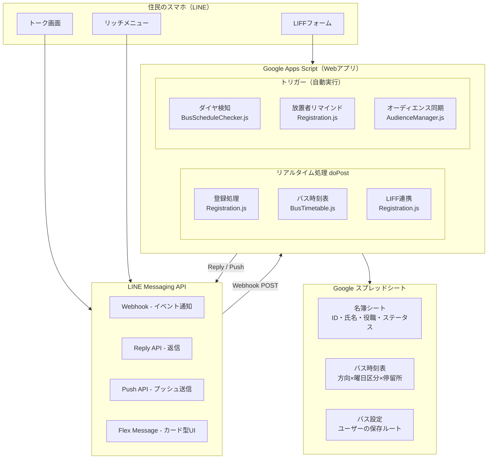
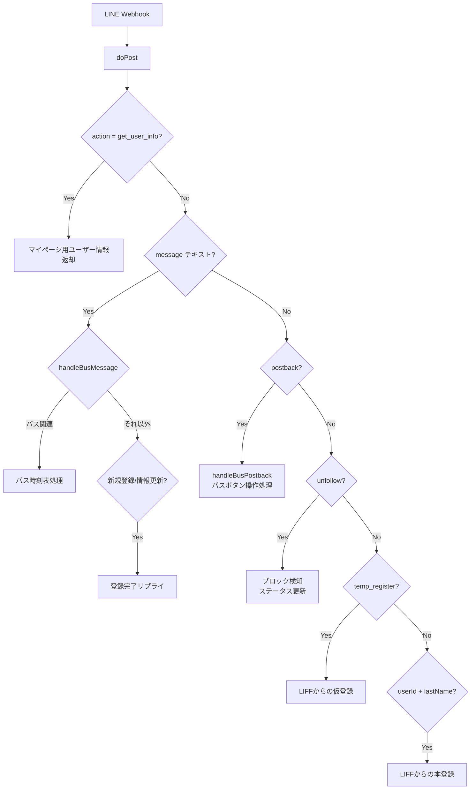
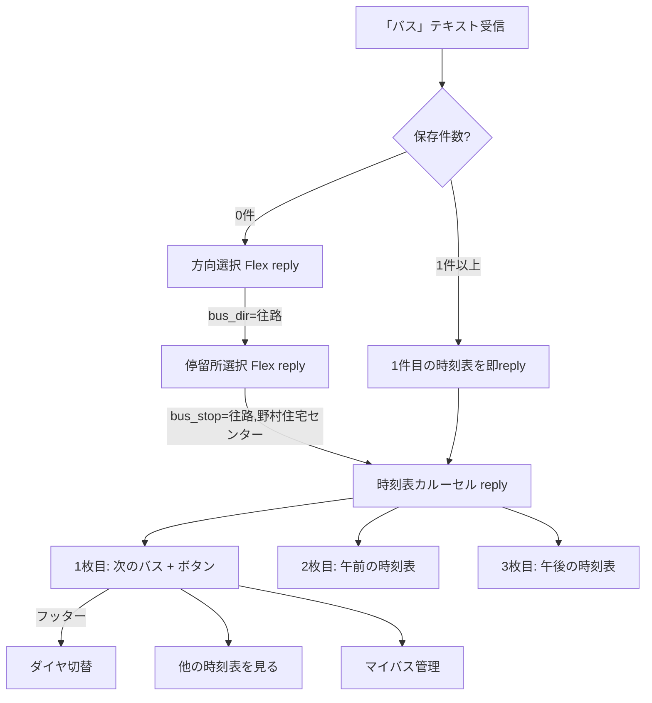

# システム構成ドキュメント

## 全体構成

## メッセージ処理フロー

### doPost の処理順序

### バス時刻表の処理フロー

> **設計方針:** 全ての返信はReply APIを使用。Push APIは使用禁止（メッセージ枠消費を防止）。時刻表データはCacheServiceでキャッシュ（6時間）し、高速応答を実現。

## ファイル詳細

> **用語：**
> - **ファイル（.js / .gs）** — プログラムのコードが書かれたテキストファイル。GASエディタでは `.gs` と表示される
> - **関数（function）** — ファイルの中にある「ひとつの処理のまとまり」。GASエディタの関数セレクタから選んで実行できる
> - 例：`Registration.js` というファイルの中に `doPost()` や `saveTempUser()` といった関数が入っている

### Registration.js — ユーザー登録・名簿管理
LINEからの全リクエストを最初に受け取るファイル。
- `doGet(e)` — ブラウザからの直接アクセスに応答
- `doPost(e)` — LINEからのリクエストを受け取って振り分ける（最初に呼ばれる関数）
- `saveTempUser()` — LIFFフォームからの仮登録を名簿に保存
- `updateFullUserInfo()` — 本登録。名簿に全情報を書き込む
- `checkDropoutUsers()` — 登録途中で離脱した人にリマインドを送る（定期実行）
- `updateBlockStatus()` — ユーザーがBotをブロックしたらステータスを更新
- `linkRichMenuToUser()` — 登録完了後にリッチメニューを紐付ける
- `sendPushMessage()` — 管理者への通知用。住民への返信には使わない

### BusTimetable.js — バス時刻表の全機能
バス時刻表の検索・表示・保存に関する全処理。
- `handleBusMessage(event)` — 「バス」「マイバス」等のテキストを判定して処理
- `handleBusPostback(event)` — ボタンが押されたときの処理（方向選択、停留所選択等）
- `getTimetableData_()` — スプレッドシートから時刻表データを読み込む（6時間キャッシュ）
- `getStopNames()` — 停留所の名前リストを取得する
- `getBusTimetable()` — 指定した停留所・曜日の時刻一覧を返す
- `getDayType(date)` — 今日が平日か土休日かを判定する（祝日も考慮）
- `buildTimetableFlex()` — 時刻表カルーセル（次のバス＋午前＋午後）を組み立てる
- `buildDirectionSelectFlex()` — 「どこ行きのバスですか？」画面を組み立てる
- `buildStopSelectFlex()` — 「乗るバス停は？」画面を組み立てる
- `buildSettingsListFlex()` — マイバス管理画面（保存済み一覧）を組み立てる
- `getUserBusSettings()` — ユーザーの保存済みルートを取得する
- `saveUserBusSetting()` — ルートを保存する
- `deleteUserBusSetting()` — ルートを削除する
- `renameUserBusSetting()` — ルートの名前を変更する
- `busReplyFlex()` — カード型の画面をLINEに返信する
- `busReplyText()` — テキストメッセージをLINEに返信する

### BusScheduleChecker.js — ダイヤ改正の自動検知
毎週月曜に自動実行し、バスのダイヤが変わっていないかチェックする。
- `checkBusScheduleChanges()` — チェックを実行してメールで結果を送る（トリガーで実行）
- `checkKeikyuNews_()` — 京急バスのお知らせページに「ダイヤ改正」等のキーワードがあるか確認
- `checkTimetableData_()` — 公式サイトの時刻とスプレッドシートの時刻を比較する
- `fetchOfficialTimes_()` — 京急バス公式サイトから時刻データを取得する
- `testBusScheduleChecker()` — 手動でチェックを試すテスト用

### ImportBusTimetable.js — 時刻表データの投入
ダイヤ改正時に使う。JSON形式の時刻データをスプレッドシートに書き込む。
- `importBusTimetable()` — スプレッドシートをクリアしてJSONからデータを投入する
- ファイル内に全停留所の時刻データがJSON形式で入っている

### AudienceManager.js — オーディエンス自動同期
名簿の役職に基づいてLINEのオーディエンス（配信グループ）を自動更新する。
- `batchSyncAudiences()` — 全オーディエンスを一括同期する（毎晩定期実行）

### FriendsListUpdater.js — 友だちリスト更新
LINEの友だち全員のリストを取得してスプレッドシートに保存する。
- `updateFriendsList()` — 友だちリストを更新する（定期実行）

### RichMenuCreator.js — リッチメニュー作成
LINEのトーク画面下部に表示されるメニューを作成・更新する。
- `createRichMenu()` — リッチメニューを新規作成する

### RepairShiftedRows.js — データ修復
名簿データの列ずれを検出・修復するユーティリティ。
- `repairShiftedRows()` — ずれた行を修復する
- `dryRunRepairShiftedRows()` — 修復せずにずれた行を確認だけする

### RichMenuIDChcecker.js — リッチメニューID確認
現在設定されているリッチメニューのIDを確認する。
- `checkAllRichMenus()` — 全リッチメニュー一覧を表示

### allusers.js — 全ユーザー名取得
- `getAllUserNames()` — 全ユーザーの名前を取得する

### test.js — テスト用
GASエディタから手動実行してデバッグに使う。
- `testResponseTimes()` — 各工程の処理速度を計測する
- `testBus()` — バス機能の基本動作テスト（停留所・曜日判定・時刻取得）
- `testPost()` — doPostのテスト用

## 環境情報

### GASプロジェクト

| 環境 | プロジェクト名 | スクリプトID |
|------|-------------|------------|
| 本番 | Jichikai_Official_LINE | `1mEHWPfs0m92pFUntsXT6n1FGuCK-T5rBPubuPKesnJPspFN9RqbLEAlt` |
| テスト | LINE_meibo_Test | `1-2Kr1ZbD2l-H8_wmNVdbZ6ZeIpnjz_2j-Uk3kBDSfa6p1hcpL2rZER0U` |

### スプレッドシート

| 用途 | ID |
|------|-----|
| 名簿（本番） | `1TRsP9W6D1oDbURI7ymNWoIN2-lOlYrN-SiwsOJzaRvI` |
| 名簿（テスト） | `168Y3g20bxjmro_zQMEOe6yiinknUZKED90pfQw5D4p4` |
| バス時刻表・ユーザー設定 | `1t6h-9Guiu72jVNtaNv28DYplMenyYcK11m_4jll7BGE` |

### デプロイ

| 環境 | デプロイID |
|------|----------|
| 本番 | `AKfycbzE41Wr8fbNJjqopnY2ldKxJJ5LELQNNYw09J6wYeRG5oDGe9LPqNPolOvZ4kkYZoW8` |
| テスト | `AKfycbyxZ7C3-_enOgID77Oaw00-QHtnNOxl7gHoUkV9kkKuVl_ugGLb7XKU_MS7QOfxhIQIAQ` |

- デプロイIDは固定。バージョンのみ更新するためWebhook URLの変更は不要
- `.clasp.json` のスクリプトIDで本番/テストを切り替え

### GASトリガー（自動実行）

| 関数 | 頻度 | 内容 |
|------|------|------|
| checkDropoutUsers | 数分おき | 仮登録放置者へのリマインド |
| checkBusScheduleChanges | 週1回（月曜） | ダイヤ改正検知メール |
| batchSyncAudiences | 毎晩 | オーディエンス同期 |

### GAS権限スコープ（appsscript.json）

| スコープ | 用途 |
|---------|------|
| script.external_request | LINE API、京急バスサイトへの通信 |
| spreadsheets | スプレッドシート読み書き |
| calendar.readonly | 祝日判定 |
| script.send_mail | ダイヤ改正通知メール |

## セキュリティ考慮事項

- **ACCESS_TOKEN**: Registration.js にハードコード。GASプロジェクトのアクセス権限で保護
- **LINE UserID**: スプレッドシートに保存。スプレッドシートの共有設定で管理
- **Webアプリアクセス**: `ANYONE_ANONYMOUS`（Webhook受信のため必要）、実行者は `USER_DEPLOYING`
- **GitHubリポジトリ**: Private設定。ACCESS_TOKENは本番/テストで異なる値を使用
